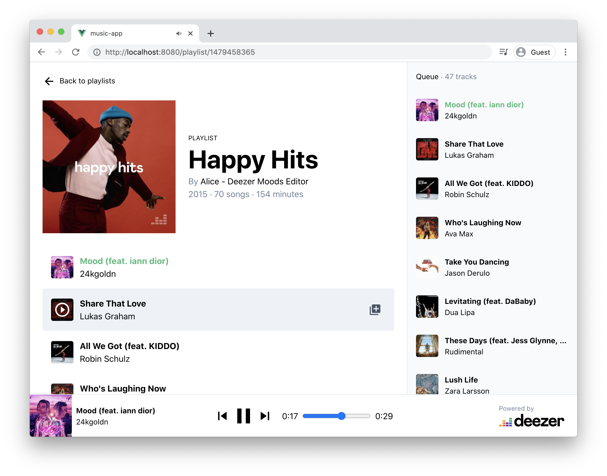

# Exercise 8

In this exercise, you'll practice with Vue.js, Vue Router, and Vuex by building a music player web application. The application will fetch Data from [Deezer Simple API](https://developers.deezer.com/api) and use the [HTML audio element](https://developer.mozilla.org/en-US/docs/Web/HTML/Element/audio) to play tracks in the browser.

*Here is an illustration of how your app could look like*



## Requirements

Your application should meet should the following requirements.


**Home page**

- It displays the 20 most popular playlists of Deezer. The title and cover image are displayed for each playlist.
- Users can click on a playlist to open the "Playlist detail" page.


**Playlist detail page**

- It displays general information for the current playlist: At least the cover image and the title.
- It displays the list of tracks. Each track should display the title, the artist, and the album cover image.
- Users can select a track to play. 


**The player**

- The player stays visible on both pages and should not be interrupted when the user navigates from one page to another. You don't need to customize the browser's default controls such as pause/resume, seek, and volume.
- Additional controls should be added to play the "previous" and the "next" track. For this, you'll have to implement a "queue" mechanism. It's you're choice to define the meaning of "next" / "previous" track. The state of the queue can be kept in memory, so you don't need to display its list of tracks.


## Deezer API

The [Deezer Simple API](https://developers.deezer.com/api) doesn't require any authentication; however, it has the following restrictions (which are totally fine for this exercise)

- Request rate limit: 50 requests / 5 seconds.
- The API returns only 30 seconds clips for each track
- Cross-Origin Resource Sharing ([CORS](https://developer.mozilla.org/en-US/docs/Web/HTTP/CORS)) is not enabled, so you'll not be able to call the API directly from the browser with [fetch](https://developer.mozilla.org/en/docs/Web/API/Fetch_API). Instead, you can call the API through a server (already set up in this project)
  

### Popular playlists endpoint

Get 20 popular playlist from deezer

https://api.deezer.com/chart/0/playlists?limit=20


### Single playlist endpoint

Get a playlist by id (908622995) and the list of tracks.

[https://api.deezer.com/playlist/908622995](https://developers.deezer.com/api/explorer?url=playlist/908622995)


## Project setup

This project was initialize with [Vue CLI](https://cli.vuejs.org/) and it's also using the [vue-cli-plugin-express](https://github.com/mathieutu/vue-cli-plugin-express). 


First, run the following command to install project dependencies

```sh
yarn install
```

Then start the server with
```sh
yarn express
```

And finally starts the Vue.js application with
```sh
yarn serve
```

